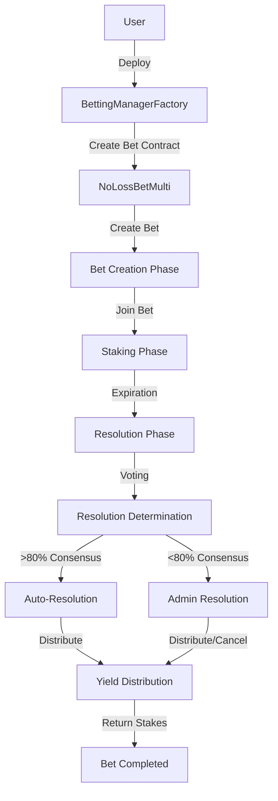

# BETM3 Smart Contract Implementation Guide

## Contract Architecture Overview

### Core Contracts

#### BettingManagerFactory.sol

```solidity
contract BettingManagerFactory is Ownable {
    // State Variables
    address[] public bettingContracts;

    // Events
    event BettingContractCreated(address indexed bettingContract, address indexed creator);

    // Functions
    function createBettingContract(address _token) external returns (address);
    function getBettingContractsCount() external view returns (uint256);
    function getBettingContract(uint256 index) external view returns (address);
}
```

The BettingManagerFactory serves as the entry point for creating new betting contracts. It:
- Deploys new NoLossBetMulti contract instances
- Maintains a registry of all deployed contracts
- Transfers ownership of each deployed contract to its creator
- Provides query functions to access the registry

#### NoLossBetMulti.sol

```solidity
contract NoLossBetMulti is Ownable, ReentrancyGuard {
    // Core Data Structures
    struct Bet {
        address creator;
        string condition;
        uint256 expiration;
        bool resolved;
        uint256 totalStakeTrue;
        uint256 totalStakeFalse;
        uint256 resolutionTrueWeight;
        uint256 resolutionFalseWeight;
        bool resolutionFinalized;
        bool winningOutcome;
        mapping(address => uint256) stakeOnTrue;
        mapping(address => uint256) stakeOnFalse;
        address[] participantsTrue;
        address[] participantsFalse;
        mapping(address => bool) resolutionVoted;
    }

    // Events
    event BetCreated(...);
    event BetJoined(...);
    event ResolutionVoteSubmitted(...);
    event BetResolved(...);
    event BetResolutionCancelled(...);

    // Core Functions
    function createBet(...) external;
    function joinBet(...) external;
    function submitResolutionOutcome(...) external;
    function finalizeResolution(...) external;
    function adminFinalizeResolution(...) external;
}
```

## System Flow & Interactions



## Contract Interaction Flow

### 1. Factory Deployment & Bet Creation
```sequence
User->Factory: Deploy BettingManagerFactory
User->Factory: createBettingContract(token)
Factory->NoLossBetMulti: Deploy new instance
Factory->User: Return contract address
User->NoLossBetMulti: createBet(params)
```

### 2. Betting Phase
```sequence
Participant->NoLossBetMulti: joinBet(betId, stake, prediction)
NoLossBetMulti->Token: transferFrom(participant, stake)
NoLossBetMulti->Storage: Record stake & prediction
```

### 3. Resolution Phase
```sequence
Participant->NoLossBetMulti: submitResolutionOutcome(betId, outcome)
NoLossBetMulti->Storage: Record weighted vote
Anyone->NoLossBetMulti: finalizeResolution(betId)
NoLossBetMulti->Token: Distribute yield & return stakes
```

## Key Parameters & Constants

```solidity
// NoLossBetMulti Constants
uint256 public constant DEFAULT_BET_DURATION = 7 days;
uint256 public constant MIN_STAKE = 10 * 10**18;
uint256 public constant RESOLUTION_PERIOD = 24 hours;
uint256 public yieldRate = 5; // 5% default yield rate
```

## Yield Distribution Formula

```
Total Yield = Total Stake * Yield Rate
Winners Share = Total Yield * 0.8  // 80% to winners
Losers Share = Total Yield * 0.2   // 20% to losers

Individual Winner Payout = Original Stake + (Stake * Winners Share / Total Winning Stake)
Individual Loser Payout = Original Stake + (Stake * Losers Share / Total Losing Stake)
```

## Security Considerations

1. **Reentrancy Protection**
   - All external calls after state changes
   - ReentrancyGuard implementation

2. **Access Control**
   - Owner-only administrative functions
   - Participant validation

3. **Input Validation**
   - Minimum stake requirements
   - Valid timeframes
   - Proper bet status checks

4. **Economic Security**
   - No loss of principal
   - Transparent yield distribution
   - Fair voting mechanism

## Gas Optimization Strategies

1. **Storage Optimization**
   - Packed structs
   - Minimal state variables
   - Event usage for historical data

2. **Computation Optimization**
   - Cached calculations
   - Efficient loops
   - Batch processing

## Testing Strategy

1. **Unit Tests**
   - Bet creation
   - Stake management
   - Resolution voting
   - Yield distribution

2. **Integration Tests**
   - Factory interactions
   - Token transfers
   - Complete bet lifecycle

3. **Edge Cases**
   - Zero stakes
   - Timeframe boundaries
   - Resolution edge cases

## Upgrade Considerations

1. **Future Enhancements**
   - Multiple token support
   - Advanced yield strategies
   - Enhanced governance

2. **Backward Compatibility**
   - Storage layout preservation
   - Event compatibility
   - Function signature stability